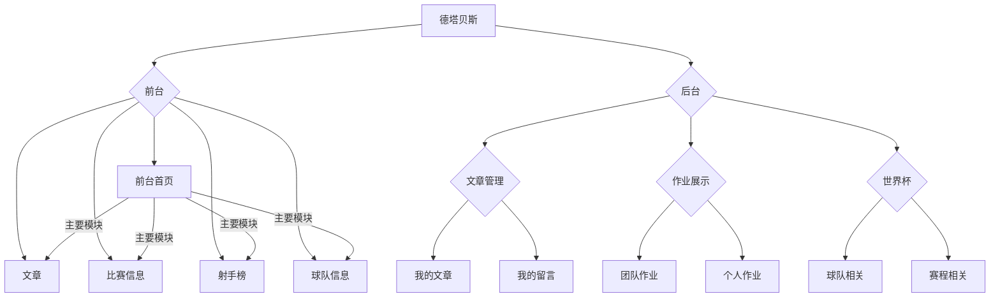
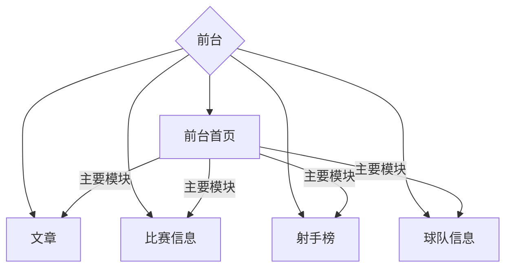

# 设计文档
## 一、数据库设计


### 1.世界杯部分

#### 1.1 ER图


#### 1.2 各表内容介绍

  所有表的引擎均设置为*InnoDB*，字符集为*utf8 -- UTF-8 Unicode*，排序规则为*utf8_general_ci*。外键删除更新均设为*CASCADE*（级联操作）。
  

- db_players

属性名 | 类型 | 属性含义 | 备注信息
---|---|---|---
player_id| char(10) | 球员id | 主键 
team_id	|char(10)|	国家队id|外键，参照team表
player_name|char(50)|	球员中文名|
position_cn|	char(50)|	场上位置|
club_cn|	char(50)|	俱乐部名|
age	|char(20)|	年龄|
birth_date|	char(20)|出生|
weight|	char(10)|	体重|
height|	char(10)|	身高|	
jersey_num|	char(5)|	球衣号码|
pic	|varchar(255)|	球员照片url|	
team_logo| varchar(255)|	国家队Logo url|	
DeleteStatus|bit|删除标志位|默认1

两个照片url用于通过网络直接调取所需照片。本表主要存储球员的基本信息。

- db_top_scorer


属性名 | 类型 | 属性含义 | 备注信息
---|---|---|---
row_id|	int|	记录球员排名,用于排序|	主键
player_id|	char(10)|	球员ID	|外键，参照players表
goals| 	char(5)|	进球数	
penalty|	char(5)|	点球数	
owngoal|	char(5)|	乌龙数	
assists|	char(5)|	助攻数	
minutes|	char(5)|	出场时间	
sl_team_id|	char(10)|	球队ID	
DeleteStatus|bit|删除标志位|默认1

本表主要存储在射手榜排名前120的球员在世界杯上的整体表现和排名。

- db_player_data

属性名 | 类型 | 属性含义 | 备注信息
---|---|---|---
player_id|	char(10)|	球员id|	主键
home_name_cn|	char(50)|	主队名称|	主键 team表外键
away_name_cn|	char(50)|	客队名称|	主键 team表外键
home_score|	char(5)|	主队得分|	
away_score|	char(5)|	客队得分|	
mins_played|	char(5)|	出场时间|
goals|	char(5)|	进球数|	
goal_assist|	char(5)|	助攻|	
total_scoring_att|	char(5)|	射门数|	
total_pass|	char(5)|	传球|	
accurate_pass|	char(5)|	传准|	
total_att_assist|	char(5)|	传威胁球|
fouls|	char(5)|	犯规数|	
was_fouled|	char(5)|	被侵犯|	
won_tackle|	char(5)|	抢断|	
total_clearance|	char(5)|	解围|	
saves|	char(5)|	扑救|	
red	|char(5)|	红牌|	
yellow|	char(5)|	黄牌|	
status_cn|	char(5)|	比赛状态|	
DeleteStatus|bit|删除标志位|默认1

本表存储球员在世界杯各场比赛中的表现。

- db_teams

属性名 | 类型 | 属性含义 | 备注信息
---|---|---|---
sl_team_id|char(10)|	球队ID|	主键且唯一
team_name|	char(50)|	球队名称| 主键且唯一
goals|	char(5)|	进球|
total_scoring_att|	char(5)|	射门|
total_pass|	char(10)|	传球|
total_tackle|	char(5)|	抢断|
possession_percentage|	char(10)|	控球率	|
pass_percentage|	char(10)|	传球成功率|
yellow|	char(5)|	黄牌|	
red	|char(5)|	红牌|
fk_foul_won	|char(5)|	任意球	
won_corners|	char(5)|	角球
total_cross|	char(5)|	传中
total_offside|	char(5)|	越位	
total_throws|	char(5)|	界外球|
post_door|	char(5)|	击中门框|
DeleteStatus|bit|删除标志位|默认1

本表存储参加世界杯各球队的有关比赛的统计信息。

- db_team_info

属性名 | 类型 | 属性含义 | 备注信息
---|---|---|---
tid| char(10)|	球队id|	主键 team表外键
team_name|	char(50)|	球队名称| team表外键	
coach|	char(50)|	教练名|
family|	char(50)|	球队合照|	
king|	char(100)|	重要球星|
honor|	char(100)|	最好成绩|
DeleteStatus|bit|删除标志位|默认1

本表存储了参加世界杯的各球队的一些基本信息。

- db_score_board

属性名 | 类型 | 属性含义 | 备注信息
---|---|---|---
sl_id|	char(10)|	球队ID|主键 team表外键
team_cn|	char(50)|	球队名称|	team表外键
team_order|	char(5)|	球队排名	
count|	char(5)|	场次
win|	char(5)|	胜	
lose|	char(5)| 负	
draw|	char(5)|	平	
goal|	char(5)|	进球	
losegoal	|char(5)	|失球	
truegoal	|char(5)	|净胜球	
score|	char(5)|	积分
groups|	char(5)|	小组
logo|	varchar(255)|	国家图片
DeleteStatus|bit|删除标志位|默认1

本表存储了各球队在世界杯小组赛期间的表现。


- db_games

属性名 | 类型 | 属性含义 | 备注信息
---|---|---|---
game_id|char(11)|比赛ID|主键
date|char(20)|比赛日期
time|char(10)|比赛开始时间
team1|char(50)|比赛主队名称|team表外键
team1_id|char(10)|比赛主队ID|team表外键
team2|char(50)|比赛客队名称|team表外键
team2_id|char(10)|比赛客队ID|team表外键
score1|char(5)|主队得分
score2|char(5)|客队得分
groups|char(5)|比赛所在小组
matchcity|char(50)|比赛城市
round|char(5)|比赛轮次
DeleteStatus|bit|删除标志位|默认1

本表存储了世界杯期间各场比赛的基本信息。

### 2.团队信息部分

#### 2.1 ER图


#### 2.2 各表内容介绍

- user

由yii自动生成，包括用户注册时填写的大部分信息。

- db_news

属性名 | 类型 | 属性含义 | 备注信息
---|---|---|---
NID|int(11)|新闻ID|主键
Title|varchar(255)|新闻标题
Keywords|varchar(255)|新闻关键词
AuthorID|int(11)|作者ID|user表外键
PublishTime|datatime|发布时间
Content|text|新闻内容
Hits|int(11)|点击量
UpdateTime|datetime|新闻更新时间
DeleteStatus|bit|删除标志位|默认1

本表存储关于新闻的全部主体信息。

- db_news_comment

属性名 | 类型 | 属性含义 | 备注信息
---|---|---|---
CID|int(11)|评论ID|主键
NID|int(11)|新闻ID|news表外键
UserID|int(11)|评论者ID|user表外键
CommentContent|varchar(255)|评论内容
CommentTime|datetime|评论时间
Type|bit|评论类型|
CommentName|varchar(255)|评论名称
DeleteStatus|bit|删除标志位|默认1

本表存储关于新闻评论的信息。评论主要有两种类型，对于新闻本身的评论以及对于其下评论的评论，如果是后者则需要填写评论名称。

- db_homework_personal

属性名 | 类型 | 属性含义 | 备注信息
---|---|---|---
HID|int(11)|作业ID|主键
HomeworkName|varchar(255)|作业名
Path|varchar(255)|存储路径
MemberID|int(11)|成员ID|group_member表外键
Mark|varchar(255)|作业备注

本表用于存储互联网数据库课程成员个人作业信息。

- db_group_member

属性名 | 类型 | 属性含义 | 备注信息
---|---|---|---
StudentID|int(11)|学号|主键
StudentName|varchar(24)|成员姓名
StudentMajor|varchar(11)|成员专业
PersonalProfile|text|个人简介
ResponsiblePart|text|负责部分
Sex|char(2)|性别
Birthday|date|生日
Polity|varchar(64)|政治面貌
Email|varchar(64)|邮箱
Tel|varchar(11)|电话
DeleteStatus|bit|删除标志位|默认1

本表用于存储开发成员的信息。

- db_homework_group

属性名 | 类型 | 属性含义 | 备注信息
---|---|---|---
HID|int(11)|作业ID|主键
HomeworkName|varchar(255)|作业名称|
Path|varchar(255)|作业存储路径
Mark|varchar(255)|作业备注

本表用于存储互联网数据库课程的团队作业信息。


## 二、模块设计




### 1.前台模块



#### 1.1前台首页

- 主要模块

从前台首页可以看到对于其它各个模块的介绍，并可以通过前台首页跳转到其它各个模块。

- 团队信息

首页将介绍开发团队——***德塔贝斯*** 的基本信息。

- 团队成员信息

#### 1.2文章模块

该模块主要呈现关于世界杯的新闻，在该模块只能进行对文章的查看和评论（且游客不能进行评论），不能在前台的文章模块对文章进行修改和增添。

#### 1.3比赛信息

该模块可以查看具体的比赛信息、并包含淘汰赛的流程图和小组赛分组即具体比赛情况、积分情况、并按照比赛时间呈现比赛的流程表。同样可以查看具体每场比赛的比赛详情和对阵情况。

#### 1.4球队信息

该模块主要呈现参加世界杯的32支球队在本届世界杯的表现，并且可以查看球队的基本信息和比赛赛程、球员表现。

#### 1.5射手榜

该模块主要呈现在本届世界杯射手榜前100的球员的基本信息，并且包含球员各场比赛的具体表现情况和个人信息、技术汇总信息。

### 2.后台模块

```
graph TB
C{后台}--> I{文章管理}
I--> J[我的文章]
I--> K[我的留言]
C--> L{作业展示}
L--> M[团队作业]
L--> N[个人作业]
C--> O{世界杯}
O--> P[球队相关]
O--> Q[赛程相关]
```

当管理用户登录后，可以从前台页面进入后台，同样用户也可以从后台进入前台。

#### 2.1 文章管理

- 我的文章：查看登录者发布的文章并且可以进行编辑和删除操作，在该模块还可以发布新的文章。
- 我的留言：查看用户对于自己文章或者自己评论发布的留言。

#### 2.2 作业展示
- 团队作业：查看互联网数据库课程团队作业并展示创作团队成员信息。
- 个人作业：查看团队成员互联网数据库课程的个人作业。

#### 2.3 世界杯
- 球队相关：该模块可以查看全部球队和球员的基本信息，并可以对基本信息进行更新操作。
- 赛程相关：该模块可以查看世界杯全部比赛的基本信息，并可以对基本信息进行更新操作。


## 三、流程图


```
graph TB
A[前台首页]-->|进入后台|B[后台首页]
A-->|点击球队模块|C[球队排行页面]
B-->|进入前台|A
C-->|点击球队模块|D[球队信息页面]
D-->|点击赛程栏查看比赛|F[比赛信息页面]
D-->|点击球员|G[球员信息页面]
A-->|点击射手榜模块|H[射手榜页面]
H-->|点击球员|G
A-->|点击比赛信息|I[赛程页面]
I-->|点击比分|F
I-->|点击球队|D
A-->|点击文章模块|J[文章列表页面]
J-->|点击文章|K[文章内容页面]
B-->oa{文章管理}
oa-->|点击我发布的文章|a[用户发布文章页面]
a-->|点击编辑|b[文章编辑页面]
oa-->|点击新建文章|c[文章创建页面]
oa-->|点击我的留言|d[留言查看页面]
B-->ob{作业展示}
ob-->|点击团队介绍|e[团队介绍页面]
ob-->|点击团队作业|f[团队作业页面]
ob-->|点击团队成员|h[个人作业页面]
B-->oc{世界杯}
oc-->i[球队信息管理]
i-->|点击更新|j[球队信息更新页面]
oc-->k[球员信息管理]
k-->|点击更新|l[球员信息更新页面]
oc-->q[赛程管理]
q-->|点击更新|w[比赛信息更新页面]


```
